# YouTubeリサーチツール 完全マニュアル

初めての方でも、最初の設定からリサーチ実行まで迷わず進められるようにまとめた説明書です。  
このツールはインストール不要で、ブラウザだけで動きます。

- バージョン: 1.0
- 最終更新日: 2026-04-28
- 推奨ブラウザ: Chrome

---

## 第0章 はじめに

### このツールでできること

- キーワードで YouTube 動画をまとめて調べる
- 再生数だけでなく、1日平均再生数や登録者比で伸びている動画を見つける
- 競合チャンネルの傾向を一覧で見る
- よく使われるタイトル表現や投稿時間帯を把握する
- Excel / CSV に保存してあとから見返す

### 使い始める前に必要なもの

- Chrome などのブラウザ
- Google アカウント
- 購入時に届いたライセンスキー
- YouTube API キー

### 所要時間の目安

- 初回設定: 約10分
- 2回目以降: 数十秒

---

## 第1章 ツールを開く

### 1-1. ライセンスキーを入力する

購入時に届いたメールに記載されている URL を Chrome で開くと、最初にライセンス画面が表示されます。  
ここで、メールに記載されたライセンスキーを入力して `認証する` を押します。

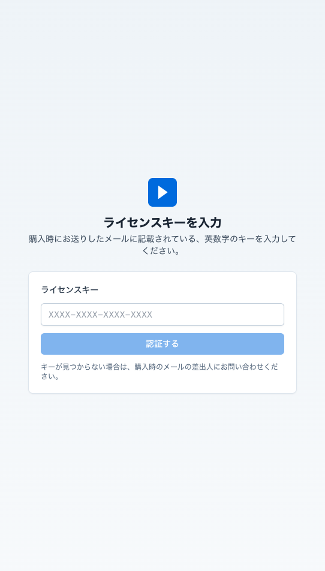

#### ポイント

- 入力形式は `XXXX-XXXX-XXXX-XXXX`
- ライセンスキーは初回認証後、ブラウザ側に保存されます
- 次回以降は再入力が不要になることがあります

---

## 第2章 初回オンボーディング

ライセンス認証が終わると、初回のみ 3 ステップの案内が表示されます。

### 2-1. ステップ1 このツールでできること

最初の画面では、このツールの主な機能が簡単に紹介されます。内容を確認したら `次へ →` を押します。

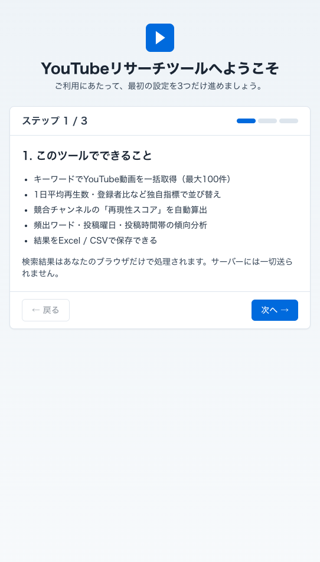

### 2-2. ステップ2 YouTube API キーを登録する

次の画面では、YouTube API キーの説明と入力欄が表示されます。  
この画面で特に大事なのは次の4点です。

- 上部の説明: APIキーは「あなた専用」であること
- `APIキーの取り方` の折りたたみ説明
- 赤い注意枠: APIキーに必ず「制限」をかけること
- 入力欄と `✓ 接続テストして保存` ボタン

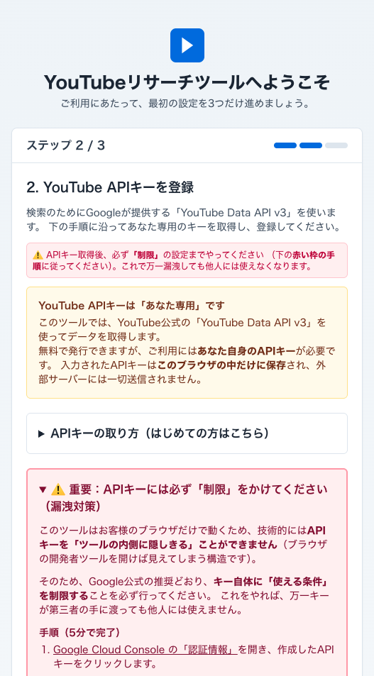

### 2-3. ステップ3 準備完了

APIキーの保存が成功すると、最後に完了画面が表示されます。  
ここでは次の内容が案内されます。

- ホーム画面からリサーチを始められること
- APIキーはあとから右上の `設定` でも変更できること
- 結果は `動画リスト` `チャンネル分析` `競合分析` `サムネ一覧` で確認できること

最後に `✓ ホームへ進む` を押すと利用開始です。

---

## 第3章 YouTube API キーを取得する

この章は最重要です。  
YouTube リサーチツールは Google 公式の `YouTube Data API v3` を使ってデータを取得します。

### 3-1. Google Cloud Console にログインする

まず、以下を開いて Google アカウントでログインします。

- [Google Cloud Console](https://console.cloud.google.com/)

### 3-2. プロジェクトを新しく作る

1. 画面上部の `プロジェクトを選択` を押します
2. `新しいプロジェクト` を選びます
3. 任意の名前を入力します
   例: `YouTubeリサーチ用`
4. `作成` を押します

### 3-3. YouTube Data API v3 を有効化する

1. 左メニューの `APIとサービス` を開きます
2. `ライブラリ` を押します
3. 検索欄に `YouTube Data API v3` と入力します
4. 該当 API を開いて `有効にする` を押します

### 3-4. API キーを発行する

1. 左メニューの `APIとサービス` → `認証情報` を開きます
2. `+ 認証情報を作成` を押します
3. `APIキー` を選びます
4. `AIza...` で始まるキーが表示されるのでコピーします

### 3-5. API キーに必ず制限をかける

APIキーは、そのままだと他人に使われる可能性があります。  
必ず次の設定を行ってください。

1. 作成した API キーの詳細画面を開きます
2. `アプリケーションの制限` で `ウェブサイト` を選びます
3. `ウェブサイトの制限事項` に、このツールの URL を `/*` 付きで登録します

例:

```text
https://your-tool.example.com/*
```

4. `APIの制限` で `キーを制限` を選びます
5. `YouTube Data API v3` のみにチェックを入れます
6. `保存` を押します

### 3-6. もしキーが漏れた場合

1. `認証情報` 画面を開く
2. 該当キーを削除する
3. 新しいキーを作り直す
4. ツール側の API キーも更新する

### この章の補足

この章は Google アカウントにログインした状態での実画面撮影が必要です。  
今回の版では、手順本文を先に完成させています。最終配布版では、この章のスクリーンショットを追加してください。

---

## 第4章 ツールに API キーを登録する

APIキーをコピーしたら、ツールのオンボーディング画面に戻ります。

### 4-1. API キーを貼り付ける

オンボーディングの `APIキーを入力` 欄に、コピーしたキーを貼り付けます。

### 4-2. 接続テストして保存する

`✓ 接続テストして保存` を押すと、接続確認が行われます。

成功すると、緑色で次のようなメッセージが表示されます。

- `✓ 接続OK。APIキーを保存しました。`

### 4-3. ホームへ進む

保存が終わると、最後のステップに進めるようになります。  
`✓ ホームへ進む` を押してください。

---

## 第5章 ホーム画面の見方

ホーム画面では、API使用状況と検索条件をまとめて確認できます。

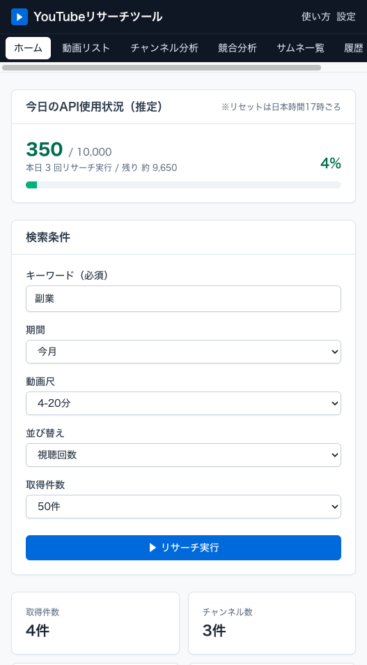

### 5-1. 上部ナビ

上部には以下のタブがあります。

- ホーム
- 動画リスト
- チャンネル分析
- 競合分析
- サムネ一覧
- 履歴・使用量

### 5-2. 今日の API 使用状況

上部のカードでは、今日どれだけ API を使ったかを確認できます。

- 左の大きい数字: 今日の使用量
- `/ 10,000`: 1日あたりの無料枠
- `本日 3回リサーチ実行` のような表記: 実行回数
- 右の `%`: 1日枠の使用割合

### 5-3. 検索条件

ホーム画面で設定できる主な項目は次の通りです。

- キーワード
- 期間
- 動画尺
- 並び替え
- 取得件数

---

## 第6章 実際に検索してみる

### 6-1. キーワードを入力する

キーワード欄に調べたいテーマを入力します。  
例: `副業`

### 6-2. 各項目の意味

| 項目 | 内容 |
|---|---|
| 期間 | 今日 / 今週 / 今月 / 3ヶ月 / 全期間 |
| 動画尺 | 全て / 4分未満（ショート寄り）/ 4-20分 / 20分以上 |
| 並び替え | 視聴回数 / 関連度 / 新着 / 評価 |
| 取得件数 | 10 / 25 / 50 / 100 |

### 6-3. リサーチ実行中の表示

`▶ リサーチ実行` を押すと、進捗が表示されます。

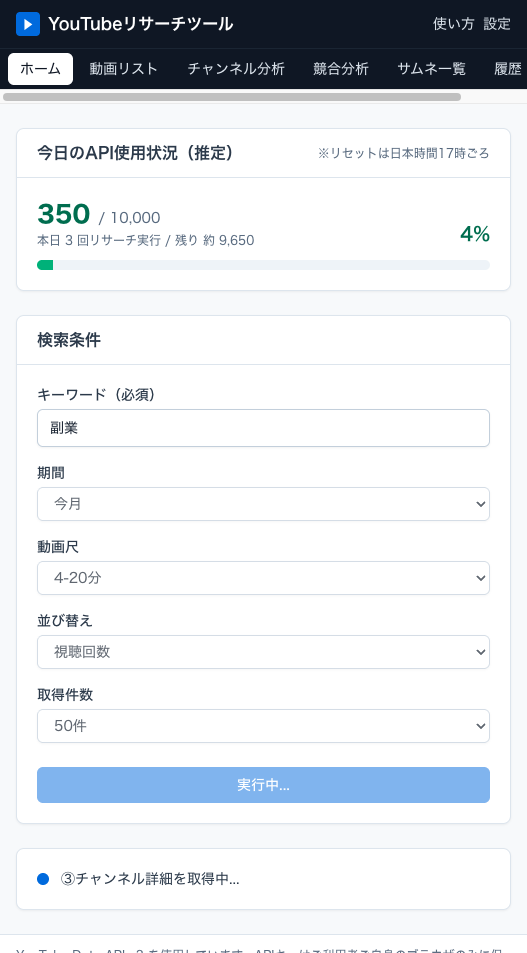

主な進捗文言は次の通りです。

- ① 動画IDを検索中...
- ② 動画詳細を取得中...
- ③ チャンネル詳細を取得中...
- ④ 分析中...

### 6-4. 完了後のサマリー

完了すると、ホーム画面下部に結果の要約が表示されます。

- 取得件数
- チャンネル数
- 最高再生数
- 消費ユニット(目安)

結果確認は主に `動画リスト` タブから始めます。

---

## 第7章 動画リスト

動画リストでは、取得した動画を1本ずつ表で確認できます。

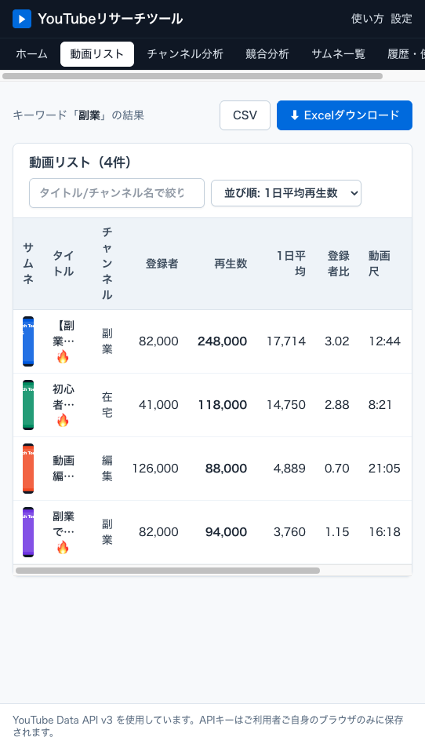

### 7-1. 上部の操作

- 検索欄: タイトル / チャンネル名で絞り込み
- 並び順: 1日平均再生数 / 再生数 / 登録者比 / 公開日 / 登録者数 / 動画尺
- `CSV`
- `Excelダウンロード`

### 7-2. 各列の意味

| 列名 | 意味 |
|---|---|
| サムネ | 動画のサムネイル |
| タイトル | 動画タイトル |
| チャンネル | 投稿元チャンネル |
| 登録者 | チャンネル登録者数 |
| 再生数 | 動画の総再生数 |
| 1日平均 | 公開後の日数で割った平均再生数 |
| 登録者比 | 再生数 ÷ 登録者数 |
| 動画尺 | 動画の長さ |
| 公開日 | 動画の公開日 |
| 開く | YouTube を別タブで開く |

### 7-3. `🔥` マークの意味

タイトル横の `🔥` は、登録者比が 1.0 を超えている動画です。  
つまり、登録者数より多く再生されている可能性がある「伸びている動画」です。

### 7-4. 並び替えのおすすめ

まずは `登録者比` に切り替えて見ると、バズ寄りの動画を見つけやすくなります。

---

## 第8章 チャンネル分析

チャンネル分析では、同じテーマで当たっているチャンネルをまとめて比較できます。

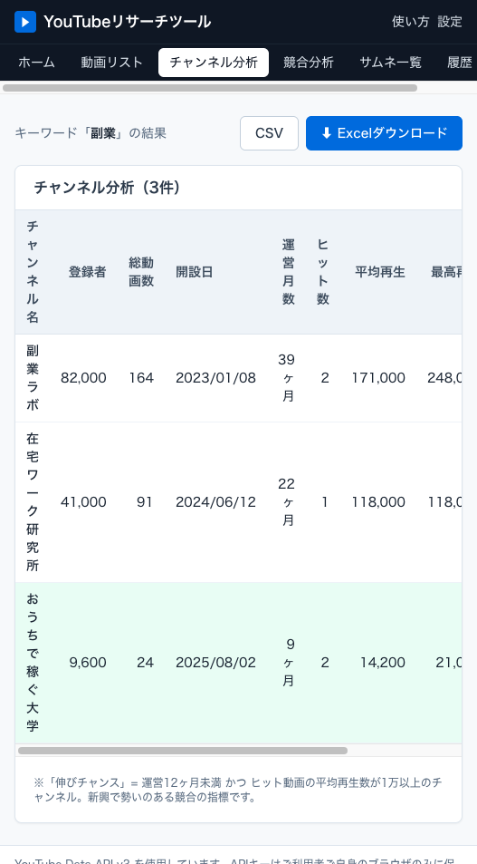

### 8-1. 各列の意味

- チャンネル名
- 登録者
- 総動画数
- 開設日
- 運営月数
- ヒット数
- 平均再生
- 最高再生
- 再現性スコア
- 判定

### 8-2. 再現性スコアとは

再現性スコアは、次の考え方で見ます。

```text
ヒット数 ÷ 総動画数
```

数値が高いほど、そのチャンネルは狙ったテーマで継続的に再生を取れている可能性があります。

### 8-3. 伸びチャンスとは

緑背景や `伸びチャンス` の表示は、次の条件を満たしたチャンネルです。

- 運営12ヶ月未満
- 平均再生数1万以上

つまり、まだ新しいのに勢いがある競合です。

---

## 第9章 競合分析

競合分析では、タイトルの傾向や、投稿時間帯の傾向をまとめて見られます。

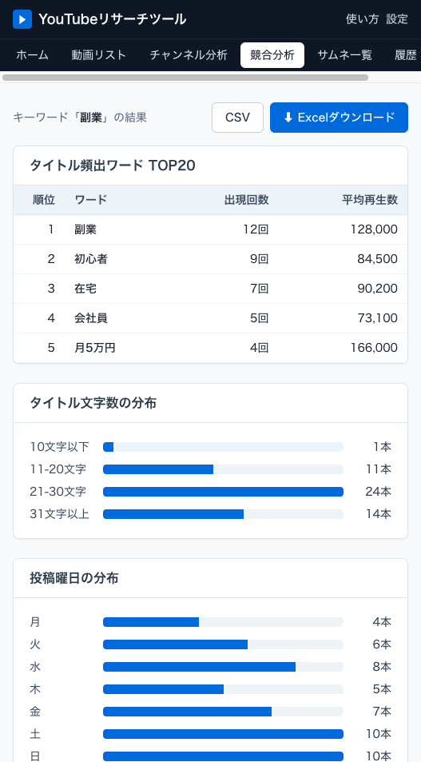

### 9-1. タイトル頻出ワード TOP20

上部の表では、競合がよく使っている単語を確認できます。

- タイトル作成の参考
- サムネ文言の参考
- 視聴者が反応しやすい切り口の確認

### 9-2. 分布グラフの見方

下部には4種類の分布があります。

- タイトル文字数の分布
- 投稿曜日の分布
- 投稿時間帯の分布
- 動画尺の分布

競合が集中している時間帯を見つけたり、逆に空いている時間帯を狙ったりする判断に使えます。

---

## 第10章 サムネ一覧

サムネ一覧では、再生数順でサムネイルをまとめて見られます。

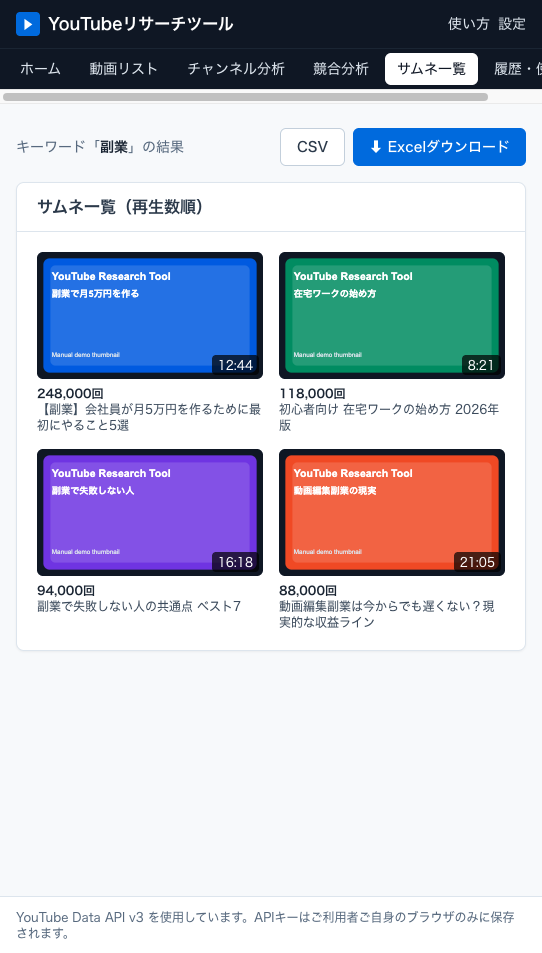

### 10-1. 活用方法

- 目を引く色使いを調べる
- 文字数の多さ・少なさを比べる
- よく使われる構図を探す
- 同じテーマの勝ちパターンを把握する

サムネをクリックすると、該当動画を YouTube で開けます。

---

## 第11章 履歴・使用量

履歴・使用量タブでは、過去の検索と API 使用状況を確認できます。

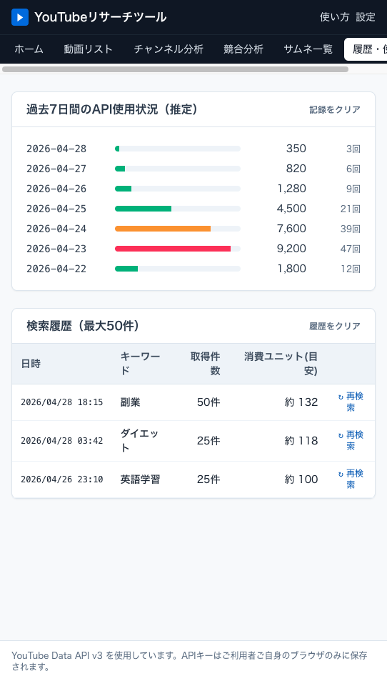

### 11-1. 過去7日間の API 使用状況

上のカードでは、日別の使用量がバーで表示されます。

- 緑: まだ余裕がある
- 黄: やや多い
- 赤: かなり使っている

### 11-2. 検索履歴

下の一覧では、次の情報が見られます。

- 日時
- キーワード
- 取得件数
- 消費ユニット(目安)

`↻ 再検索` を押すと、同じキーワードをホーム画面に戻して再利用できます。

---

## 第12章 Excel / CSV で保存する

### 12-1. ダウンロード場所

`動画リスト` などの上部右側に、次のボタンがあります。

- `CSV`
- `Excelダウンロード`

### 12-2. Excel の内容

Excel には主に次の情報が入ります。

- 動画リスト
- チャンネル分析
- 頻出ワード
- サマリー

Excel を使うと、あとから見返したり、自分なりに並び替えたりしやすくなります。

### この章の補足

ダウンロード後の Excel の見た目は、最終版でスクリーンショットを追加するとより親切です。

---

## 第13章 設定を変更する

右上の `設定` を押すと、設定モーダルが開きます。

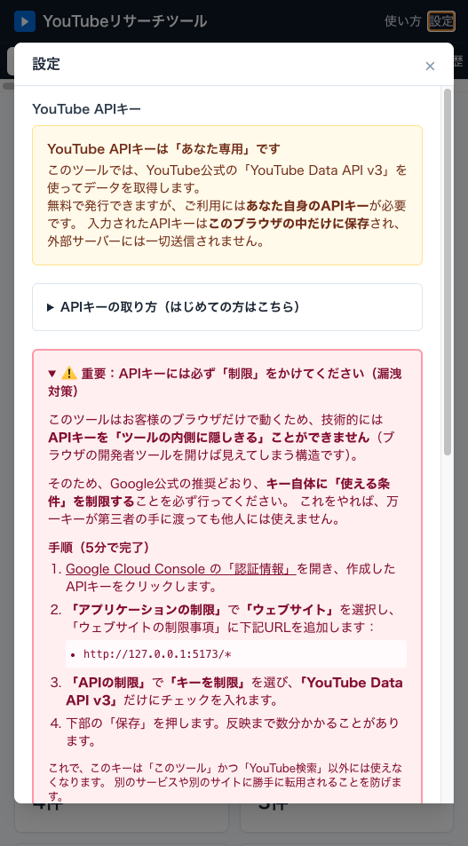

### 13-1. 変更できる内容

- API キーの再設定
- 保存済み API キーの削除
- 除外ワード
- 除外チャンネル ID
- 地域コード
- 言語

### 13-2. どんな時に使うか

- APIキーを入れ直したい
- 大手公式を除外したい
- 海外向けの検索に切り替えたい
- 特定チャンネルを結果から外したい

---

## 第14章 使い方を見る

右上の `使い方` を押すと、アプリ内ヘルプが開きます。

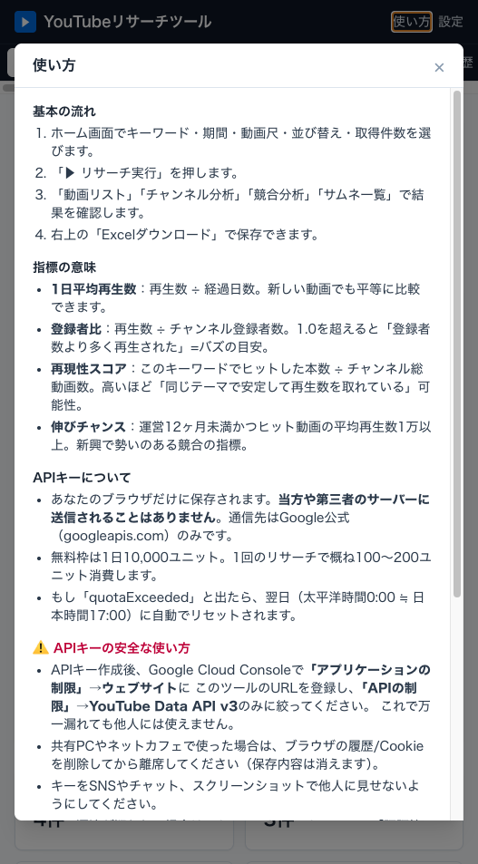

困ったときは、まずここを見返すのがおすすめです。

---

## 第15章 よくあるトラブル

| 症状 | 原因 | 対処 |
|---|---|---|
| `YouTube APIエラー: API key not valid` | APIキーの貼り付けミス、または制限設定ミス | APIキーを入れ直し、Google Cloud 側の制限も確認 |
| `quotaExceeded` | 1日の無料枠を使い切った | 翌日のリセットを待つ |
| 該当する動画が見つかりませんでした | キーワードが細かすぎる、期間が短すぎる | キーワードを広げる、期間を長くする |
| 大手公式ばかり出る | 除外設定をしていない | `設定` の `除外チャンネルID` を使う |
| 結果が遅い | 取得件数が多い | まず 25 件で試す |
| ライセンスキーが通らない | 入力ミス | 購入メールを見直す |
| 保存内容が消えた | ブラウザの履歴や保存データを消した | APIキーを再設定し、必要なら Excel から復元 |

---

## 巻末 用語集

### API

外部サービスの機能を使うための仕組みです。

### APIキー

YouTube API を使うための「利用者ごとの鍵」です。

### クォータ / ユニット

YouTube API の1日あたりの利用上限です。  
通常は 1日 10,000 ユニットまで使えます。

### ライセンスキー

購入者だけがツールを使えるようにするための認証キーです。

### localStorage

ブラウザの中に設定を保存しておく仕組みです。  
このツールでは、APIキーや履歴の保存に使われます。

### 登録者比

再生数 ÷ 登録者数。  
高いほど「登録者数のわりに伸びている動画」と考えやすくなります。

### 再現性スコア

ヒット数 ÷ 総動画数。  
同じテーマで継続的に伸びているチャンネルかどうかを見る指標です。

### 1日平均再生数

再生数を公開後の日数で割った数字です。  
新しい動画と古い動画を比較しやすくなります。

